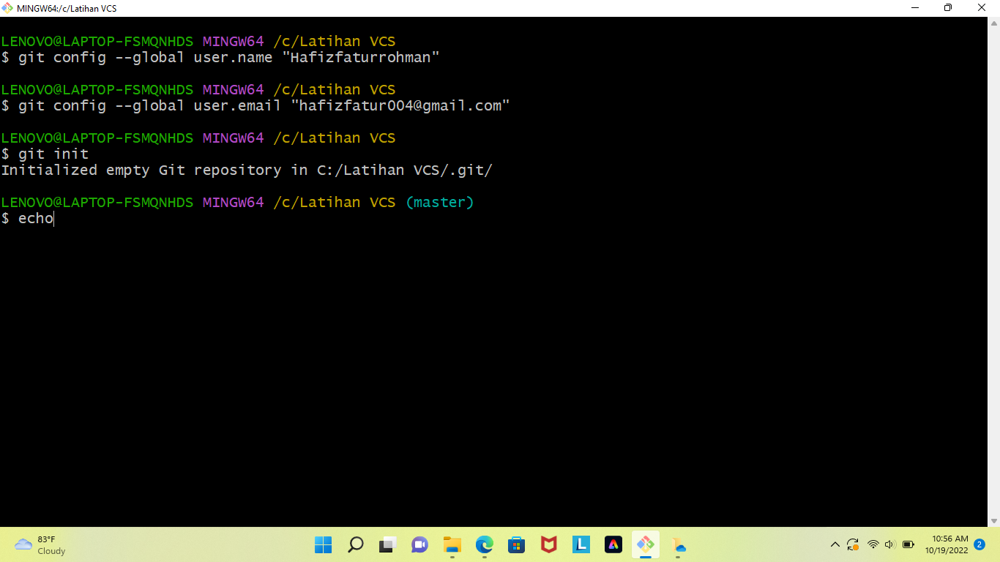

#Latihan VSC
1.Pastikan anda sudah mendownload aplikasi Gitnya (git-scm.com)
2.Masuk ke web GitHub. Agar Git kita terhubung dengan GitHub kita harus membuat akun terlebih dahulu -masuk ke web GitHub

-buat akun klik "create an account"

-jika sudah masuk, buatlah sebuah repository dengan cara klik new,

kode untuk membuat/menambah sebuah file README.md
.png)

3.Buat file repository di windows explore dengan nama file "LatihanVCS" img.7

-lalu buka menggunakan Git Bash img.8

-menambahkan global config repository, gunakan command git config --global user.name "nama akun GitHub anda" git config --global user.email "email akun GitHub anda"

